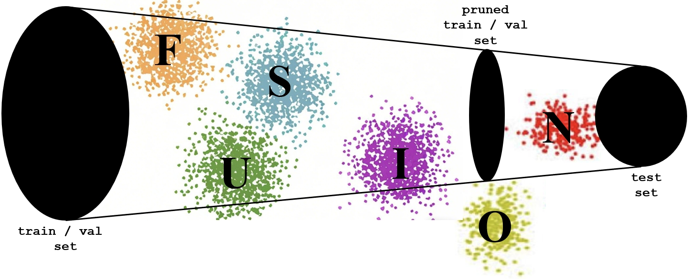
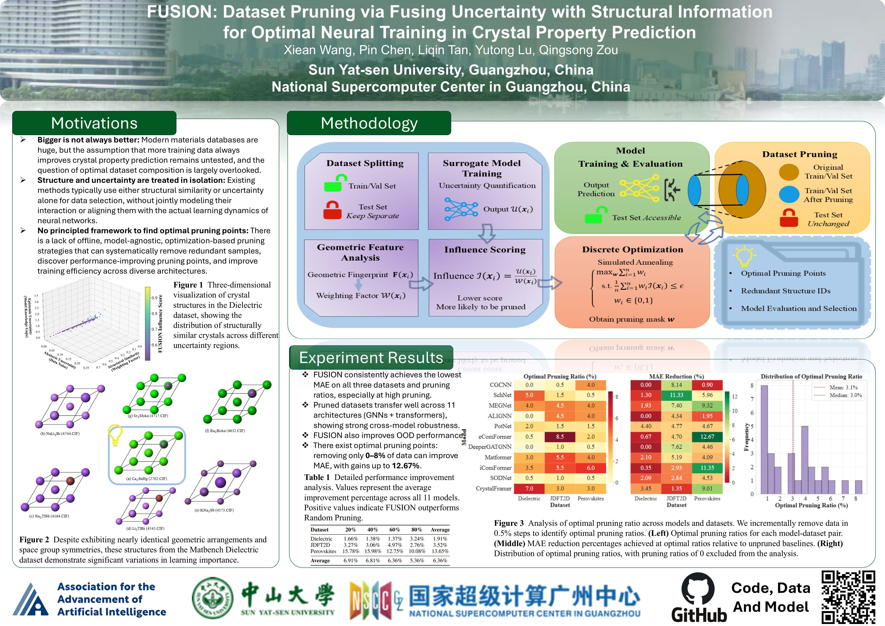

<h1>
<p align="center">
    
</p>
</h1>

<h4 align="center">

[](https://python.org/downloads) 
&nbsp;&nbsp;&nbsp;&nbsp;
[](https://aaai.org/conference/aaai/aaai-26/)
&nbsp;&nbsp;&nbsp;&nbsp;
[]()

</h4>

---
# FUSION

## Installation

1. Clone the repository:
```bash
git clone https://github.com/tetean/FUSION.git
cd FUSION
```
2.  Install dependencies:

### Some important Dependencies
| Package | Description |
|---------|-------------|
| **PyTorch** | Deep learning framework |
| **DGL** | Deep Graph Library for GNNs |
| **pymatgen** | Crystal structure manipulation |
| **jarvis-tools** | Materials science toolkit |
| **ase** | Atomic Simulation Environment |
| **dscribe** | SOAP descriptor computation |
| **spglib** | Symmetry analysis |
| **numpy** | Scientific computing |
| **scipy** | Scientific computing |
| **scikit-learn** | Machine learning utilities |
| **pandas** | Data processing |
| **tqdm** | Progress bars |
| **pyyaml** | Configuration management |


```bash
conda env create -f environment.yml -n FUSION

conda activate FUSION
```

## Quick Start

### Basic Usage
```python
from FUSION import FUSION

# Initialize FUSION
fusion = FUSION(
    config_path="config.yml",
    checkpoint_path="surrogate/perovskites/ALIGNN/example.pth.tar",
    data_path="./data",
    task="perovskites",
    epsilon=0.499,
    gamma=0.1,
    Lambda=0,
    cache_dir="./fusion_cache"
)

# Run FUSION pipeline
results = fusion.run(
    optimization_method='greedy',
    force_recompute=False
)

# Access results
pruning_mask = results['pruning_mask']
pruning_ratio = results['pruning_ratio']
print(f"Pruning ratio: {pruning_ratio:.2%}")
```

### Generate Train/Val/Test Splits

```python
from EpsilonSearcher import EpsilonSearcher
from FUSION import FUSION

# Initialize FUSION
fusion = FUSION(
    config_path="config.yml",
    checkpoint_path="surrogate/perovskites/ALIGNN/example.pth.tar",
    data_path="./data",
    task="perovskites",
    epsilon=0.01,
    gamma=0.1,
    Lambda=0,
    cache_dir="./fusion_cache"
)

# Update SOAP parameters
fusion.soap_params.update({
    'r_cut': 5.0,
    'n_max': 8,
    'l_max': 6,
    'sigma': 0.5,
    'periodic': True,
    'average': 'off',
    'sparse': False
})
fusion.symprec = 1e-5

# Compute features
fusion.compute_uncertainties(force_recompute=False)
fusion.compute_structural_similarity(force_recompute=False)
fusion.compute_uncertainty_influence(force_recompute=False)

# Find optimal epsilon values for target pruning ratios
searcher = EpsilonSearcher(fusion)
target_ratios = [0.0, 0.2, 0.4, 0.6, 0.8]
optimal_epsilons = searcher.optimize_epsilon_for_target_ratios(target_ratios)

# Generate JSON splits
epsilon_values = {i: eps for i, eps in enumerate(optimal_epsilons.values())}
json_docs = fusion.generate_json_splits(
    epsilon_values=epsilon_values,
    output_dir="./fusion_output",
    test_size=0.15,
    val_size=0.15,
    random_state=42,
    optimization_method='greedy'
)
```
> It should be noted that the Epsilon Searcher algorithm provides exact solutions for the greedy optimization strategy, where samples are selected strictly in ascending order of influence scores. However, when employing FUSION's advanced optimization methods (dynamic greedy, beam search, or enhanced simulated annealing), the algorithm serves as an approximation tool. For critical applications requiring precise pruning ratios, we recommend using the epsilon searcher as an initial estimation.

## Data Structure
```python
data/
└── perovskites/
    ├── 0.cif
    ├── 1.cif
    ├── 2.cif
    ├── 3.cif
    ├── 4.cif
    ├── 5.cif
    ├── 6.cif
    ├── ...
    └── 18927.cif
```

Meanwhile, for fast reading and to save storage space, we have provided a preprocessed Perovskites data `pkl` file that is packaged and ready for use by ALIGNN as a demonstration：
```python
data/
└── perovskites/
    └── alignn_data.pkl
```

## JSON File Structure
Each split file (train/val/test) contains multiple "models" representing different pruning levels:
```python
{
  "0": [0, 1, 2, 3, ..., 18927],      // Model 0: Full dataset (no pruning)
  "1": [0, 5, 8, 12, ..., 18927],     // Model 1
  "2": [0, 8, 15, 25, ..., 16746],    // Model 2
  "3": [5, 12, 28, 45, ..., 16134],   // Model 3
  "4": [8, 25, 50, 88, ..., 15312]    // Model 4
}
```

## Poster
<p align="center">
    
</p>

## Citation

If you use FUSION in your research, please cite:

```
@inproceedings{wang2026fusion,
  title={FUSION: Dataset Pruning via Fusing Uncertainty with Structural Information for Optimal Neural Training in Crystal Property Prediction},
  author={Wang, Xiean and Chen, Pin and Tan, Liqin and Lu, Yutong and Zou, Qingsong},
  booktitle={Proceedings of the AAAI Conference on Artificial Intelligence},
  year={2026}
}
```

---